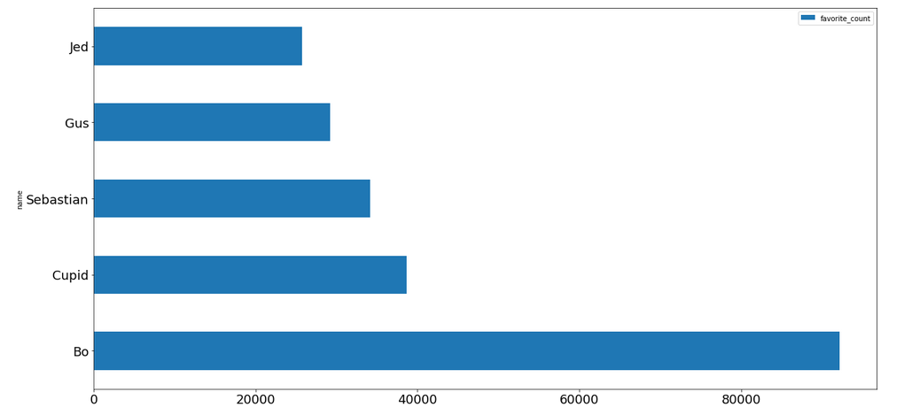
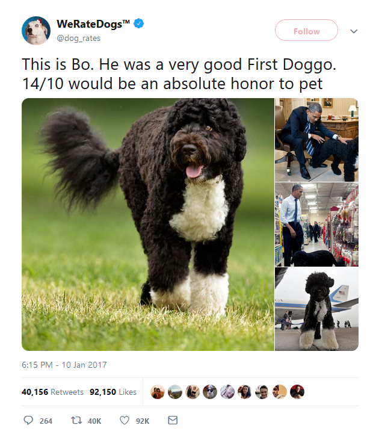
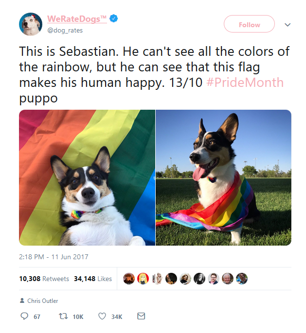
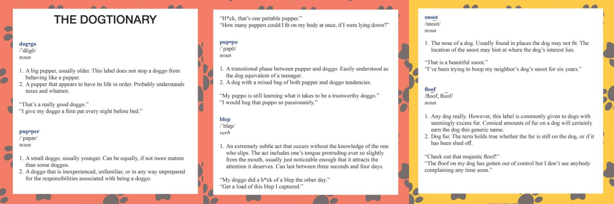
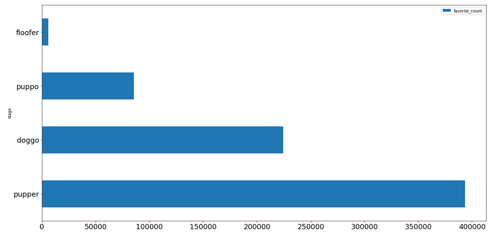

<h1 id="Let's-use-data-to-find-out-what-the-WeRateDogs-twitter-and-its-community-is-all-about!-&#128054;">Let's use data to find out what the WeRateDogs twitter and its community is all about! &#128054;<a class="anchor-link" href="#Let's-use-data-to-find-out-what-the-WeRateDogs-twitter-and-its-community-is-all-about!-&#128054;">&#182;</a></h1>

According to the <a href="https://twitter.com/dog_rates">twitter bio</a>, this community is all about "Professional Dog Ratings". The twitter profile has over 7 MILLION followers so this must be an old (in internet-age) as well as successfull community.

We could take a look at some of their latest tweets but I'm afraid those might be a little different than what a loyal follower normally sees. I bet the <strong>most famous</strong> tweets will reveal the essence of this community.

However, twitter does not have a "see most famous tweets from this profile" kind of feature. So I gathered some data and did this myself, data scientist style.

<h2 id="Most-favorited-tweets">Most favorited tweets<a class="anchor-link" href="#Most-favorited-tweets">&#182;</a></h2>
The following chart shows how many favorites that dog name got among all tweets in the dataset.

Wow! Why are those names so famous? Let's take a look now at the top 3 most favorited tweets and see who are those guys!

<h3 id="1)-92K-favorties:-Meet-Bo---Obama's-family-pet-dog">1) 92K favorties: Meet Bo - Obama's family pet dog<a class="anchor-link" href="#1)-92K-favorties:-Meet-Bo---Obama's-family-pet-dog">&#182;</a></h3>

<h3 id="2)-38K-favortes:-Cupid---The-cutest-hero-you-will-ever-meet">2) 38K favortes: Cupid - The cutest hero you will ever meet<a class="anchor-link" href="#2)-38K-favortes:-Cupid---The-cutest-hero-you-will-ever-meet">&#182;</a></h3>

<h3 id="3)-34K-favorites:-Sebastian---Proof-you-can-expect-no-prejudice-from-a-puppo">3) 34K favorites: Sebastian - Proof you can expect no prejudice from a puppo<a class="anchor-link" href="#3)-34K-favorites:-Sebastian---Proof-you-can-expect-no-prejudice-from-a-puppo">&#182;</a></h3>

<h2 id="Which-stages-are-the-most-frequent?">Which stages are the most frequent?<a class="anchor-link" href="#Which-stages-are-the-most-frequent?">&#182;</a></h2>
You may have noticed that this community has stages for their dogs, each one representing a moment in their dog life. Sebastian is a puppo, for example.

<h3 id="Let's-take-a-look-of-the-most-frequent-stages-using-a-sample-of-tweets!">Let's take a look of the most frequent stages using a sample of tweets!<a class="anchor-link" href="#Let's-take-a-look-of-the-most-frequent-stages-using-a-sample-of-tweets!">&#182;</a></h3>

So, puppies are the most popular. No wonder!

    

  

</body>

 

</html>
